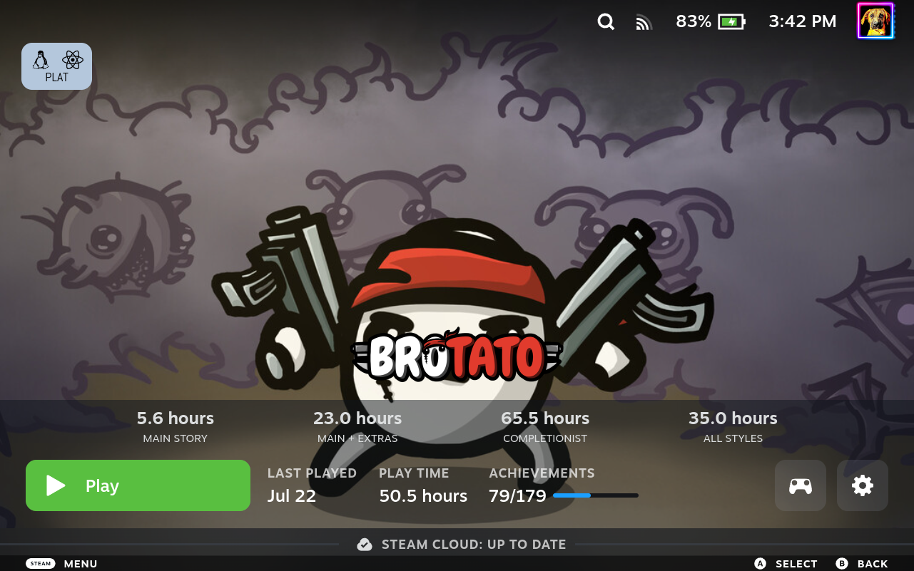

# Achievements Restored

A [Decky Loader](https://github.com/SteamDeckHomebrew/decky-loader) plugin that
**brings back the achievement progress bar Valve removed** from the Steam Deck
game-details page — the compact **"ACHIEVEMENTS  n/total  ▮▮▯"** stat next to
Play Time, with the blue completion ribbon at 100%.



## What actually happened

The bar was **not deleted**. Valve's own `MiniAchievements` component (in the
app-details PlayBar / `GameStatsSection`) still ships, with working CSS and the
live `GetAchievements(appid)` data. In Steam changelist **10546225 (~2026-03-24)**
Valve added a single guard to its `render()`:

```js
if (!this.props.onSeek) return null;
```

The Steam Deck game-details header renders its PlayBar with `onSeek: undefined`,
so the guard now returns `null` and the bar disappears. Supplying a real `onSeek`
makes Valve's own component render again — confirmed by injecting `onSeek` into
the live instance on-device (see the screenshot above).

This plugin restores it the same way: it patches the app-details route to feed
the PlayBar the `onSeek` prop Valve withheld. **It does not reimplement the bar.**

Full investigation: [`HANDOFF.md`](HANDOFF.md) and
[`research/diffs/removal_onSeek_guard.md`](research/diffs/removal_onSeek_guard.md).

## Develop

```bash
direnv allow            # loads .envrc: caches/scratch -> /tmp/Decky-SteamAchievements
pnpm install            # or npm install
pnpm run build          # rollup -> dist/index.js
pnpm run package        # build + zip for install on the Deck
```

Deploy `dist/` to `~/homebrew/plugins/Achievements Restored/` on the Deck (Decky
Loader picks it up), or install the packaged zip.

## Layout

- `src/index.tsx` — plugin entry (`definePlugin`).
- `src/achievementBar.tsx` — the route patch that restores the bar.
- `main.py` — minimal Decky backend (lifecycle only; the fix is frontend).
- `scripts/` — Decky build/package helpers + `orchestration` (symlinked engine).
- `docs/` — plans, specs, review notes (project + orchestration convention).
- `research/` — the reverse-engineering artifacts (gitignored; reports curated).

## License

GPL-3.0-or-later.
